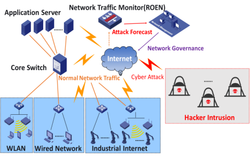
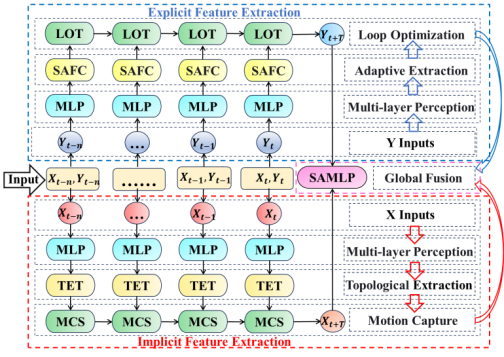

# ROEN

## 目录

- data
  - Darknet
  - ISCXIDS2012
  - TrafficLabelling
- models
  - 2012
  - 2017
  - 2020
- network.py
- untils.py
- train_2012.py
- train_2017.py
- train_2020.py
- requirements.txt

----

## Introduction



Modern network traffic detection systems face significant challenges in accurately classifying sophisticated cyber attacks. Traditional approaches relying on static traffic features (e.g., port numbers and packet sizes) prove inadequate for capturing the dynamic topological evolution inherent in Advanced Persistent Threats (APTs) and complex intrusions. This limitation stems from overlooking temporal correlations and structural dynamics within network traffic flows. Our investigation identifies this oversight as the primary cause of suboptimal performance in multi-modal traffic recognition, hybrid attack detection, and analysis with incomplete or anomalous data. To address this critical gap, we propose a novel dynamic topology-based method that quantifies evolving network structures through traffic pattern distribution transformations. Departing from traditional attention-based anomaly detection paradigms, our streamlined architecture introduces a dual-thread framework with multi-level feature fusion. This innovative design effectively integrates explicit statistical features with implicit dynamic topology information, achieving improved intrusion detection accuracy while reducing computational complexity. By modeling intrinsic interactions between statistical and topological characteristics, our method reveals latent intrusion patterns through three key innovations: (1) quantitative modeling of network topological dynamics, (2) a lightweight dual-thread architecture for efficient feature fusion, and (3) robust detection mechanisms under data scarcity. To our knowledge, this represents the first universal network intrusion detection framework that efficiently combines dynamic topological analysis with conventional statistical features. Extensive benchmark evaluations demonstrate state-of-the-art performance with significant improvements in AUC (5.8%↑) and macro-averaged AUC (7.2%↑) over existing methods, while maintaining a 23% lower computational overhead. Our solution establishes a foundation for next-generation intrusion detection systems, providing a generalizable and resource-efficient approach to counter evolving cyber threats.

### Network Architecture



The proposed Recurrent Feature Fusion Evolution Network (ROEN) consists of an Implicit Feature Extractor, an Explicit Feature Extractor, and a Global Feature Fusion Engine, as shown in Fig.
The Explicit Feature Extractor includes a multi-layer Perceptron (MLP), Adaptive Extraction (SAFC), and Loop Optimization (LOT). Its role is to extract the temporal feature representation of traffic statistics cyclically adaptively. The Implicit Feature Extractor consists of a Multi-layer Perceptron (MLP), Topological Extraction (TET), and Motion Capture (MCS), which are designed to capture the dynamic changes in network topology structure. The Global Feature Fusion Engine 
utilizes the SAMLP module to dynamically and adaptively integrate both explicit and implicit features.

**Implicit Feature Extractor (IFE)**
The Implicit Feature Extractor (IFE) includes a multi-level nonlinear information perception mechanism and a dynamic topology evolution implicit information fusion mechanism. The multi-level nonlinear information perception mechanism uses a Multi-Layer Perceptron (MLP) to extract nonlinear features from node attributes, removing noise interference from the features. The dynamic topology evolution implicit information fusion mechanism employs a Graph Convolutional Network (GCN) layer to embed node interactions at different time points and propagate topological information, ensuring that each node has access to global information. Then, Long Short-Term Memory (LSTM) layers are used to transmit information across different time points, capturing the evolving patterns of dynamic topological structure changes.

**Explicit Feature Extractor (EFE)**
The Explicit Feature Extractor (EFE) includes a multi-level nonlinear information perception mechanism and a self-attention recurrent optimization explicit information fusion mechanism. The multi-level nonlinear information perception mechanism extracts nonlinear features from edge attributes using Multi-Layer Perceptron (MLP) layers, removing noise interference from the features. The self-attention recurrent optimization explicit information fusion mechanism adaptively extracts edge statistical features using self-attention fully connected layers while feeding the extracted edge statistics at different time points into Long Short-Term Memory (LSTM) layers. It allows the model to fuse past and present edge information cyclically. Based on the fusion results, the fusion parameters and the edge feature extraction patterns are continuously adjusted, ultimately realizing a recurrent optimization process that identifies the general patterns of high-dimensional statistical features of edge information.

**Global Feature Fusion Engine (GFF)**
The Global Feature Fusion Engine (GFE) takes the extracted node topological structure evolution patterns and the general statistical patterns of edge information and inputs them into a self-attention MLP layer for adaptive dynamic fusion of global information. Finally, the fused global feature representation is passed through an activation function to perform network traffic classification.

**Dataset Description**
Although datasets such as `Darknet`, `ISCXIDS2012`, and `TrafficLabelling` are mentioned, there is no detailed description of the sources, sizes, formats, etc. If possible, you can add a brief introduction to the datasets, especially how they help validate the performance of the ROEN model.

For example:
```markdown
### Datasets
- **Darknet**: This dataset contains network data for both attack and normal traffic of darknet, suitable for evaluation of network intrusion detection.
- **ISCXIDS2012**: This dataset includes intrusion detection data from multiple real-world network environments and has been widely used in network security research.
- **TrafficLabelling**: This dataset is used for classifying and labeling network traffic.

#### Training the Model
To train the ROEN model on the TrafficLabelling dataset, you can run the following command:
```bash
python train_2017.py
```

## :page_with_curl: 开源协议

### Citation

If you use this work in your own research, please cite the following paper:
```bibtex
@article{ren2025roen,
  title={ROEN: Universal dynamic topology-adaptive evolution model for multi-modal mixed network traffic detection},
  author={Ren, Linghao and Wang, Sijia and Zhong, Shengwei and Li, Yiyuan and Tang, Bo},
  journal={Computer Networks},
  pages={111380},
  year={2025},
  publisher={Elsevier}
}
```

### Contributing

If you'd like to contribute to this project, please follow these steps:

1. Fork the repository
2. Create a new branch (`git checkout -b feature-branch`)
3. Commit your changes (`git commit -am 'Add new feature'`)
4. Push to the branch (`git push origin feature-branch`)
5. Submit a pull request
